# Proofline

Proofline validates agentic completion against user intent and evidence.



It is the acceptance layer above agents, runners, Linear, and GitHub. Agents may claim they are done. Symphony, Codex, Hermes, OpenClaw, or another executor may report progress. Proofline is the layer that decides whether the claim is actually acceptable.

The repository may still contain the `Harness` name in routes, environment variables, historical artifacts, Python modules, and stored evidence. That is intentional during the staged rename. Treat Proofline as the product name and Harness as the current compatibility namespace. See [Proofline Rename Migration](docs/architecture/proofline-rename-migration.md).

## What It Does

Proofline answers one operational question:

> Does the claimed completion match the user's intent, the task contract, current evidence, and external facts?

It does this by enforcing:

- canonical structured work contracts through `TaskEnvelope`
- completion-claim interception before work can be accepted
- GitHub artifact proof for code-bearing work
- Linear reconciliation against intended work
- bounded repair/retry paths for recoverable proof defects
- sticky manual-review gates when proof is ambiguous or unsafe
- append-only evaluation history and inspectable read models

## What It Is Not

Proofline is not:

- a PM tool
- an agent runtime
- a scheduler
- a chatbot UI
- a native macOS app
- a replacement for Linear
- a replacement for GitHub
- a competing Symphony/Codex orchestration layer

Symphony-compatible runners belong underneath Proofline as advisory execution substrates. The repair-dispatch setup checks for a Symphony-compatible execution substrate; the legacy ingress/executor bridge is compatibility wiring, not the primary runner requirement. Proofline remains the final verification and lifecycle authority. See [Symphony Execution Substrate](docs/architecture/symphony-execution-substrate.md).

## Current Operator Surfaces

Supported:

- CLI/runtime contract: `python3 -m modules.proofline_runtime ...`
- backend API
- read-only Next.js dashboard
- static local dashboard assets served by the Python backend

Not supported as active product direction:

- native macOS app packaging
- menu-bar behavior
- Launch at Login
- notarization workflows
- desktop notifications as a core dependency

Archived macOS notes remain under `docs/archive/macos/` for historical context only.

## Architecture At A Glance

```text
User intent / Linear work
        |
        v
TaskEnvelope / reset contract
        |
        v
Proofline verification and reconciliation
        |
        +--> GitHub artifact proof
        +--> Linear state reconciliation
        +--> manual review gates
        +--> repair/retry requests
        |
        v
Accepted, retrying, blocked, needs_review, failed
```

Truth boundaries:

- Linear tracks intended structured work.
- GitHub proves code and artifact facts.
- Runners and agents are replaceable workers, not truth authorities.
- Proofline owns verified lifecycle state and completion acceptance.

## Key API Surfaces

Inspection:

- `GET /health`
- `GET /tasks`
- `GET /tasks/<task_id>`
- `GET /tasks/<task_id>/read-model`
- `GET /tasks/<task_id>/timeline`
- `GET /supervision/queue`
- `GET /execution-substrate/intents`
- `GET /execution-substrate/handoffs`
- `GET /runtime/status`

Mutation:

- `POST /tasks`
- `POST /tasks/<task_id>/reevaluate`
- `POST /tasks/<task_id>/completion-claims`
- `POST /sync/github`
- `POST /reset/contracts`
- `POST /reset/contracts/<contract_id>/claims`
- `POST /reset/tick`

Ingress helper routes such as `/ingress/linear`, `/ingress/manual`, and `/ingress/openclaw` are translators into canonical submission behavior. They are not alternate truth paths.

## Local Quickstart

Install dependencies:

```bash
python3 -m pip install -r requirements.txt
pnpm install --frozen-lockfile
```

Start the backend:

```bash
python3 -m uvicorn backend.server:app --host 127.0.0.1 --port 8000
```

Run the frontend:

```bash
cp .env.example .env.local
printf 'PROOFLINE_API_BASE_URL=http://127.0.0.1:8000\n' >> .env.local
pnpm dev
```

Use the local runtime contract:

```bash
python3 -m modules.proofline_runtime --json init
python3 -m modules.proofline_runtime --json start
python3 -m modules.proofline_runtime --json status
python3 -m modules.proofline_runtime --json doctor
python3 -m modules.proofline_runtime --json stop
```

Build local dashboard assets for the Python-served dashboard:

```bash
pnpm build:dashboard:local
```

More complete setup paths:

- [Local Quickstart](docs/howto/local-quickstart.md)
- [Configure Proofline](docs/howto/configure-harness.md)
- [Local Development](docs/setup/local-development.md)

## Storage And Secrets

Proofline supports file, SQLite, and Postgres storage:

- `PROOFLINE_STORE_BACKEND=file`
- `PROOFLINE_STORE_BACKEND=sqlite`
- `PROOFLINE_STORE_BACKEND=postgres`

Harness-named environment variables remain compatibility fallbacks. Prefer Proofline-named variables in new docs and scripts.

For local CLI/web usage, prefer runtime-managed secrets over repeated shell exports:

```bash
printf '%s' "$GITHUB_TOKEN" | python3 -m modules.proofline_runtime --json secrets set github_token --value-stdin
printf '%s' "$LINEAR_API_KEY" | python3 -m modules.proofline_runtime --json secrets set linear_api_key --value-stdin
python3 -m modules.proofline_runtime --json secrets status
```

The reset verifier uses:

- `GITHUB_TOKEN` or `GH_TOKEN`
- `LINEAR_API_KEY`
- optional `OPENCLAW_*` compatibility variables for the current repair callback adapter

## Tool Requirements

Proofline is most useful when it can compare intended work against real evidence.

Minimum useful setup:

- repo access for the Proofline checkout
- Python runtime and dependencies
- a running Proofline backend or local runtime
- access to the code host that contains execution artifacts
- access to the project tracker that contains intended work

The V1 live integration pair is:

- Linear for intended work
- GitHub for artifact proof

For V1, do not present other project trackers or code hosts as first-class live validation targets. V2 can add a flexible adapter layer. A Jira/Asana/Shortcut/Notion tracker adapter would need to normalize intended work, state, dependencies, acceptance criteria, and comments into Proofline external facts. A GitLab/Bitbucket adapter would need to normalize repository, branch, commit, merge request, diff, and CI evidence into Proofline artifact facts.

Until that V2 adapter layer exists, live reconciliation is Linear/GitHub-only. Other tools may still be used for manual context, but Proofline should not imply equivalent automated validation for them.

## Hosted Deployment

The default hosted shape is one Vercel Services project:

- Next.js dashboard service
- Python backend service
- Neon-backed Postgres
- optional Vercel Blob for file-like hosted outputs

`BLOB_READ_WRITE_TOKEN` is supported when Vercel Blob is connected, but Postgres remains the canonical task/evaluation store.

Hosted runbook:

- [Vercel + Neon Deployment](docs/setup/vercel-neon.md)

## Validation

Use synthetic validation for normal development:

```bash
python3 scripts/proofline_validate.py
```

Inspect the validation plan:

```bash
python3 scripts/proofline_validate.py --list
```

Measure backend coverage:

```bash
python3 -m pip install -r requirements-dev.txt
python3 -m coverage run -m unittest discover -s tests
python3 -m coverage report -m
```

Run focused deterministic reset proofs:

```bash
python3 -m modules.reset_dryrun success
python3 -m modules.reset_dryrun review
```

Run execution-substrate dry runs:

```bash
python3 -m modules.execution_substrate_dryrun event-stream
python3 -m modules.execution_substrate_dryrun intent-consumer
python3 -m modules.execution_substrate_dryrun handoff
```

Use live Linear/GitHub only through the gated dry-run path:

```bash
HARNESS_RUN_LIVE_RESET_TESTS=1 python3 scripts/proofline_live_preflight.py --json
HARNESS_RUN_LIVE_RESET_TESTS=1 python3 -m unittest tests.test_reset_live_smoke -v
```

Approved live dry-run targets:

- Linear project: `HARNESS-DRYRUN`
- GitHub repository: `sfayka/HARNESS-DRYRUN`
- Base branch: `main`

The May 5 live smoke passed and is recorded in [Live Reset Smoke - 2026-05-05](docs/release/live-reset-smoke-2026-05-05.md).

Full validation guide:

- [Test And Validate Proofline](docs/howto/test-and-validate.md)

## Documentation Map

Start here:

- [How-To Index](docs/howto/index.md)
- [Use Proofline](docs/howto/use-harness.md)
- [Troubleshoot Proofline](docs/howto/troubleshoot.md)

Architecture references:

- [System Context](docs/architecture/system-context.md)
- [Module Boundaries](docs/architecture/module-boundaries.md)
- [TaskEnvelope](docs/architecture/task-envelope.md)
- [Verification And Completion Enforcement](docs/architecture/verification-and-completion-enforcement.md)
- [Reconciliation Rules](docs/architecture/reconciliation-rules.md)
- [Completion Interception And Artifact Validation Boundary](docs/architecture/completion-interception-and-artifact-validation-boundary.md)
- [Symphony Execution Substrate](docs/architecture/symphony-execution-substrate.md)
- [Local Runtime Contract](docs/architecture/local-runtime-contract.md)
- [Agent API Usage](docs/api/agent-api-usage.md)

Agent-facing repo rules:

- [AGENTS.md](AGENTS.md)
- [CLAUDE.md](CLAUDE.md)
- [Proofline Acceptance Skill](skills/proofline-acceptance/SKILL.md)
- [Hermes Proofline Skill Compatibility Wrapper](skills/hermes-proofline/SKILL.md)

## Development Commands

Backend:

```bash
python3 -m unittest discover -s tests
```

Frontend:

```bash
pnpm test:frontend
pnpm lint
pnpm build
```

Docs-only:

```bash
git diff --check
python3 -m unittest tests.test_hosted_docs -v
```

## Repository Layout

- `backend/`: hosted backend entrypoint.
- `app/`: Next.js dashboard routes and proxy handlers.
- `components/`: dashboard UI components.
- `lib/`: frontend API mapping and types.
- `modules/`: Python API, evaluation, stores, runtime, reset verifier, adapters, dry runs.
- `schemas/`: canonical machine-readable contracts.
- `sql/`: database schema.
- `scripts/`: validation, build, hosted dry-run, and setup helpers.
- `tests/`: backend, contract, integration, E2E, and frontend tests.
- `docs/`: how-to, architecture, demo, release, and archive notes.

## License

Licensed under the Apache License 2.0. See [LICENSE](LICENSE).
