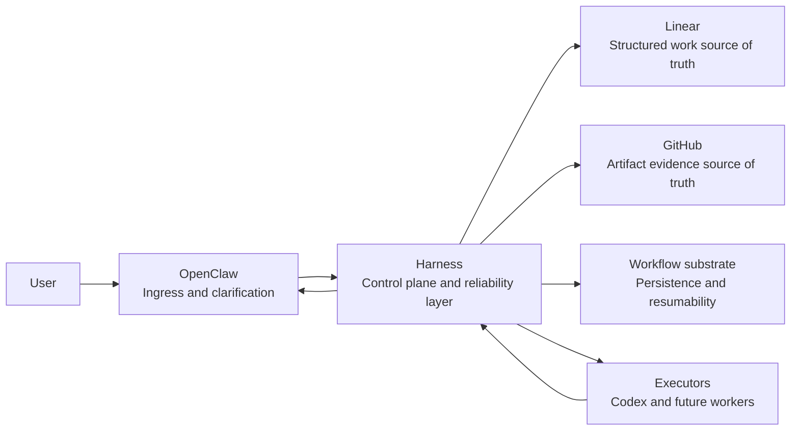

# System Context

## Objective

Define the top-level system model before implementation so future modules do not blur ingress, control-plane enforcement, systems of record, and execution.

## System Framing

Harness sits between the user-facing ingress layer and the execution layer as the system that enforces correctness.

- OpenClaw is the ingress layer.
- Harness is the control plane and reliability layer.
- Linear is the source of truth for structured work.
- GitHub is the source of truth for code artifacts such as pull requests and commits.
- Executors such as Codex are workers.
- The workflow substrate provides persistence, resumability, and coordination state for Harness itself.

## Context Diagram

The Mermaid source for the diagram lives in [system-context.mmd](system-context.mmd).

## Responsibilities By System

### OpenClaw

- collects user intent
- asks follow-up questions when intent is ambiguous
- hands validated work into Harness
- presents progress and results back to the user

### Harness

- translates validated requests into canonical work contracts
- decomposes work into manageable tasks
- delegates execution to replaceable workers
- enforces explicit lifecycle semantics, including blocked and failed states
- verifies completion against artifacts and system-of-record state
- aggregates verified outcomes for upstream reporting

### Linear

- stores epics, projects, tasks, and task state
- provides the durable structured record of planned and active work
- serves as the reference point for task ownership and status

### GitHub

- stores pull requests, commits, and code-review artifacts
- provides evidence used for completion verification in code-bearing workflows
- serves as an external artifact system, not as the control plane

### Workflow Substrate

- persists orchestration state that should survive crashes or restarts
- allows resumable long-running workflows
- stores execution checkpoints and internal coordination state
- does not replace Linear as the source of truth for work items

### Executors

- perform assigned work
- report execution progress and outputs back to Harness
- remain replaceable behind stable task contracts
- are not trusted as the source of truth for completion on their own

## Boundary Rules

- OpenClaw does not become the durable orchestrator.
- Harness does not become the user interface.
- Linear owns structured work records, not executor internals.
- GitHub owns artifact evidence records, not lifecycle policy.
- Executors do not own planning, routing, or lifecycle policy.
- The workflow substrate owns resumability, not product-level work semantics.
- completion is not accepted as true unless Harness can reconcile it with artifacts and system-of-record state

## Architectural Implications

- ingress, control-plane enforcement, systems of record, and execution remain separable
- executor implementations can change without changing Harness core planning logic
- workflow technology can change if Harness state transitions are modeled explicitly
- model-native reasoning improvements do not displace Harness as long as correctness, evidence, and auditability remain Harness-owned concerns
