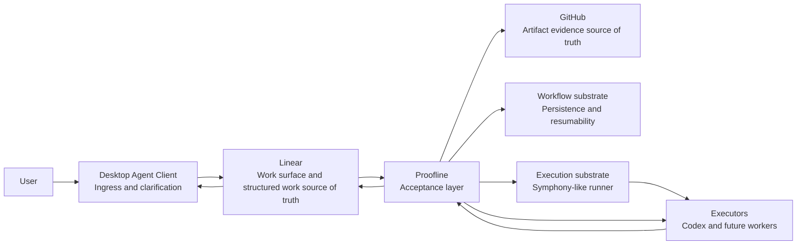

# System Context

## Objective

Define the top-level system model before implementation so future modules do not blur ingress, control-plane enforcement, systems of record, and execution.

## System Framing

Proofline sits underneath the user-facing and agent-facing work surface as the system that validates agentic completion against user intent and evidence.

`Harness` remains the current repository, API, CLI, and codebase name during the staged rename. This document uses Proofline for the product role and Harness only when referring to current implementation surfaces.

- A desktop agent client such as OpenClaw, Hermes, or a future equivalent is the ingress layer.
- Linear is the human-and-agent work surface and the source of truth for structured work.
- Proofline validates completion claims against user intent and evidence.
- GitHub is the source of truth for code artifacts such as pull requests and commits.
- Executors such as Codex are workers.
- A Symphony-like execution substrate may schedule isolated executor runs, but it is not completion truth.
- The supported operator surfaces are the CLI, backend API, and web dashboard.
- The workflow substrate provides persistence, resumability, and coordination state for Proofline's validation boundary.

Stated another way:

- Linear is the source of truth for intended work.
- GitHub is the source of truth for executed artifacts.
- Symphony-like runners are execution schedulers.
- Proofline is the source of truth for verified state and lifecycle correctness.

## Context Diagram

The Mermaid source for the diagram lives in [system-context.mmd](system-context.mmd).
An editable Excalidraw version also lives in [system-context.excalidraw](system-context.excalidraw) for visual learners and future refinement.

```mermaid
flowchart LR
    U["User"] --> O["Desktop Agent Client\nIngress and clarification"]
    O --> L["Linear\nWork surface and structured work source of truth"]
    L --> H["Proofline\nAcceptance layer"]
    H --> G["GitHub\nArtifact evidence source of truth"]
    H --> S["Workflow substrate\nPersistence and resumability"]
    H --> R["Execution substrate\nSymphony-like runner"]
    R --> E
    H --> E["Executors\nCodex and future workers"]
    E --> H
    H --> L
    L --> O
```

## Responsibilities By System

### Desktop Agent Client

- collects user intent
- asks follow-up questions when intent is ambiguous
- hands validated work into Harness
- presents progress and results back to the user

### Proofline

- consumes validated or synchronized work from ingress and work-surface systems
- translates that work into canonical acceptance contracts
- decomposes work into manageable tasks when needed
- delegates execution to replaceable workers
- enforces explicit lifecycle semantics, including blocked, in-review, and failed states
- verifies completion against artifacts and system-of-record state
- aggregates verified outcomes for upstream reporting and work-surface reconciliation

### Linear

- stores epics, projects, issues, tasks, and workflow state
- provides the durable structured record of planned and active work
- acts as the primary human-and-agent work coordination surface
- serves as the reference point for task visibility, ownership, and workflow status
- does not decide whether artifact-backed completion should be trusted

### GitHub

- stores pull requests, commits, and code-review artifacts
- provides evidence used for completion verification in code-bearing workflows
- serves as an external artifact system, not as the control plane

### Workflow Substrate

- persists orchestration state that should survive crashes or restarts
- allows resumable long-running workflows
- stores execution checkpoints and internal coordination state
- does not replace Linear as the source of truth for work items

### Execution Substrate

- polls or receives eligible work under Harness policy
- creates isolated workspaces for attempts
- launches Codex or future executor sessions
- tracks runner sessions, stalls, retries, and handoffs
- emits advisory execution events and artifact references
- does not verify completion or own lifecycle state

### Executors

- perform assigned work
- report execution progress and outputs back to Harness
- remain replaceable behind stable task contracts
- are not trusted as the source of truth for completion on their own

## Boundary Rules

- Desktop agent clients do not become the durable orchestrator.
- Harness does not become the user interface.
- Proofline does not become a native desktop-app product; the deprecated macOS shell must not own core behavior.
- Linear owns work coordination and structured work records, not completion enforcement semantics.
- GitHub owns artifact evidence records, not lifecycle policy.
- Executors do not own planning, routing, or lifecycle policy.
- A Symphony-like execution substrate does not own completion truth.
- The workflow substrate owns resumability, not product-level work semantics.
- completion is not accepted as true unless Harness can reconcile it with artifacts and system-of-record state

## Architectural Implications

- ingress, control-plane enforcement, systems of record, and execution remain separable
- Linear-facing coordination can evolve without changing Harness verification and enforcement logic
- executor implementations can change without changing Harness core planning logic
- runner implementations can change if they emit the same advisory execution-substrate events
- workflow technology can change if Harness state transitions are modeled explicitly
- model-native reasoning improvements do not displace Proofline as long as correctness, evidence, auditability, and user-intent alignment remain validation concerns

## Related Documents

- [symphony-execution-substrate.md](symphony-execution-substrate.md)
- [runtime-execution-contract.md](runtime-execution-contract.md)
- [verification-and-completion-enforcement.md](verification-and-completion-enforcement.md)
