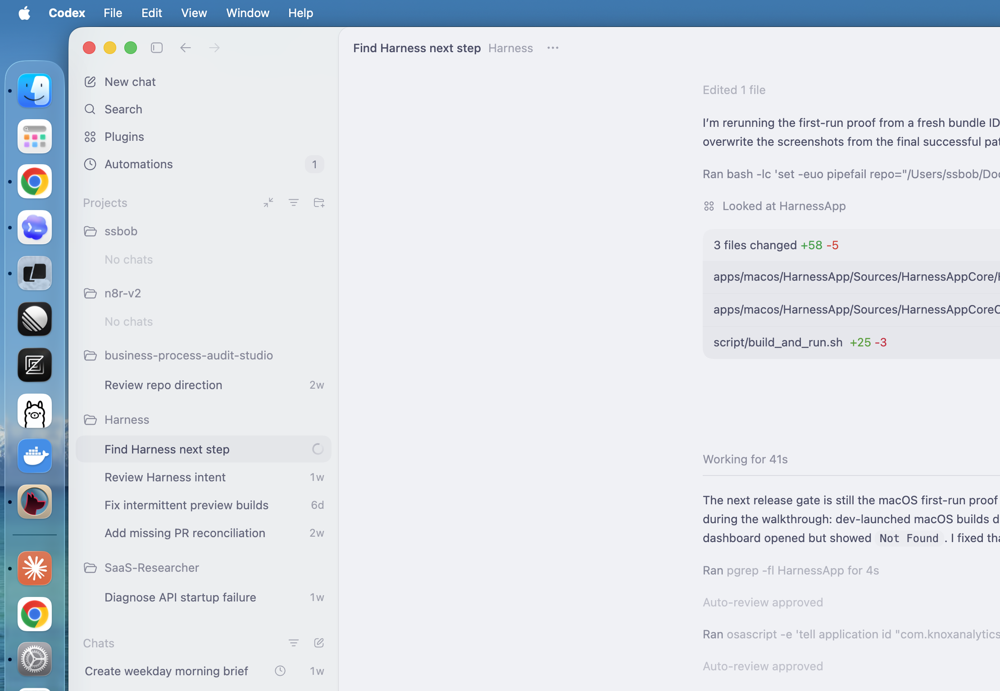
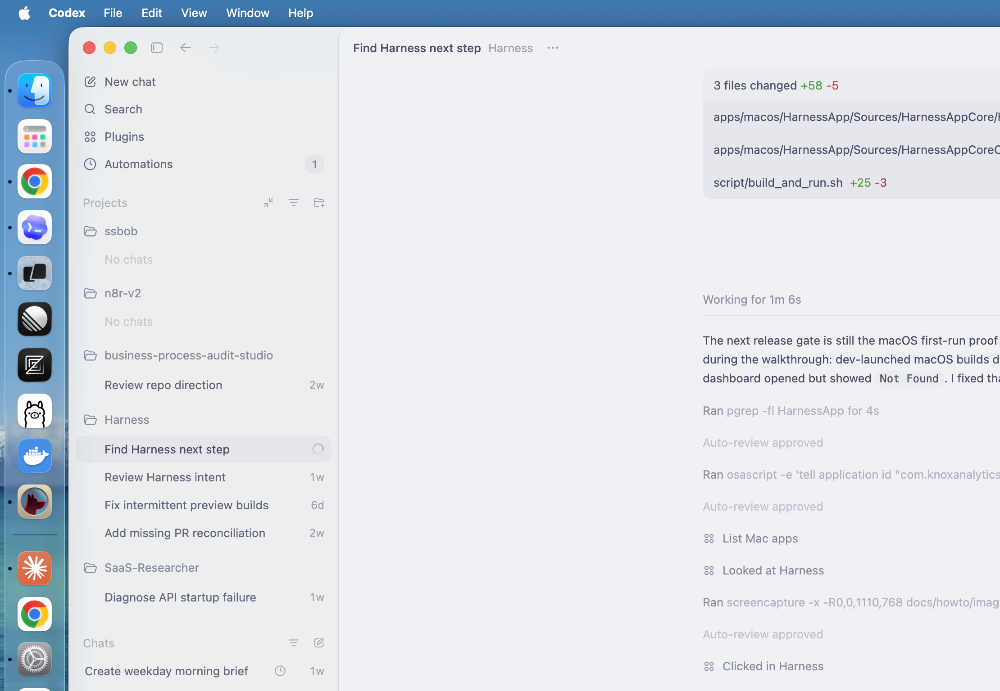
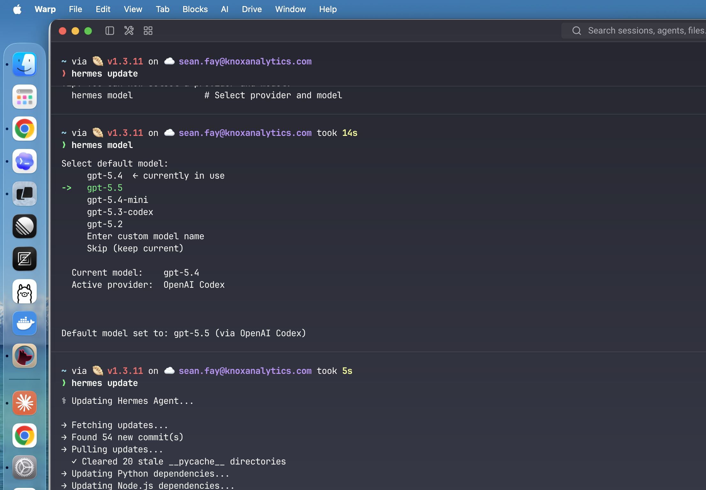

# Local Quickstart

## Goal

Get Harness running locally, prove the runtime is healthy, and open the dashboard that shows canonical task state.

## macOS App Path

For normal users, the target install path is a signed and notarized `Harness.dmg`.
They should not need Python, Node, Docker, `pnpm`, or a repo checkout.

Until the external DMG is published, maintainers can create an internal validation package with:

```bash
./script/package_macos_app.sh
```

The build writes:

- `dist/macos-release/Harness.app`
- `dist/macos-release/Harness.dmg`

The internal validation package is ad-hoc signed unless `MACOS_CODESIGN_IDENTITY` is set. External distribution still requires Developer ID signing and notarization:

```bash
export MACOS_CODESIGN_IDENTITY="Developer ID Application: ..."
export MACOS_NOTARY_PROFILE="harness-notary"
./script/package_macos_app.sh
```

After installing the app, first run should guide the user through:

- local runtime initialization
- optional Launch at Login
- optional notifications
- optional GitHub, Linear, and desktop-agent bridge setup
- dashboard launch

The app stores runtime state under `~/Library/Application Support/Harness/` and logs under `~/Library/Logs/Harness/`.

## First Run In The macOS App

On a clean first launch, Harness opens the setup assistant before the dashboard.
The default path only requires local runtime and SQLite readiness. Launch at Login, notifications, workspace folders, GitHub, Linear, and desktop-agent bridge setup are useful, but they are not required to finish core onboarding.



Use **Skip Optional Items** when you only want to prove the local app path. The dashboard step stays blocked until the local runtime is initialized, running, and healthy.



When the setup assistant shows **Ready**, choose **Finish & Open Dashboard**. The embedded dashboard should load from the local Harness runtime and show the canonical dashboard routes.



What to verify:

- the setup badge changes from `1 blocker` to `Ready`
- the dashboard opens at a loopback `/dashboard/tasks/` URL
- the dashboard renders the real Harness UI, not `{"detail":"Not Found"}`
- the task inventory can be empty on a fresh install; that is expected

## Developer Checkout Path

Use this path when you are developing Harness or validating a PR.

```bash
python3 -m pip install -r requirements.txt
pnpm install --frozen-lockfile
```

Create repo-root `.env.local` when you need live GitHub or Linear validation:

```bash
GITHUB_TOKEN=...
LINEAR_API_KEY=...
HARNESS_API_BASE_URL=http://127.0.0.1:8000
```

Start the backend:

```bash
python3 -m uvicorn backend.server:app --host 127.0.0.1 --port 8000
```

Start the dashboard in another terminal:

```bash
pnpm dev
```

Verify health:

```bash
curl -sS http://127.0.0.1:8000/health
```

Run one deterministic reset proof:

```bash
python3 -m modules.reset_dryrun success
```

For developer validation of the macOS first-run path, build the local dashboard first and launch the app through the repo script:

```bash
pnpm build:dashboard:local
./script/build_and_run.sh --verify
```

The script passes `dist/local-dashboard/` to the app when those assets exist. Without packaged dashboard assets, the runtime can be healthy but the embedded dashboard cannot render the UI.

## What Good Looks Like

- `/health` returns `status: ok`
- the dashboard opens at `http://127.0.0.1:3000`
- deterministic reset dry runs produce accepted or review-required results without live GitHub or Linear mutations
- the local app runtime can start, stop, recover, and reopen the dashboard without direct SQLite edits
