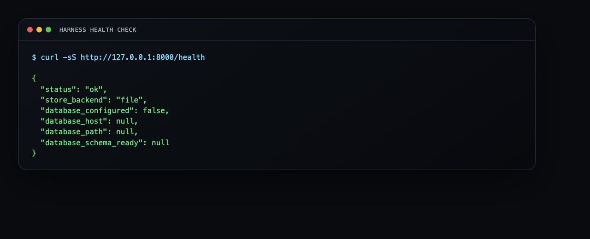
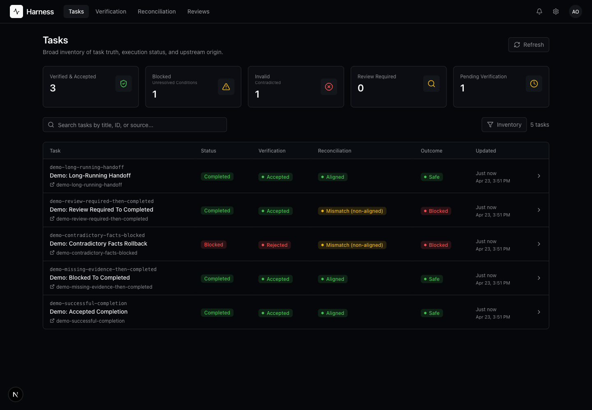
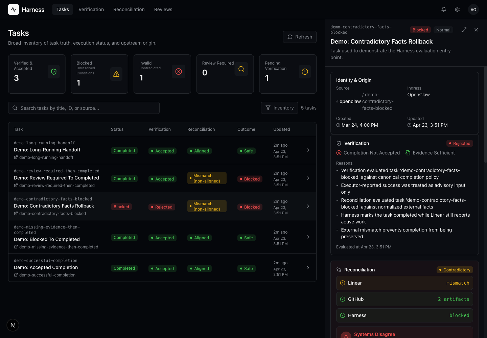
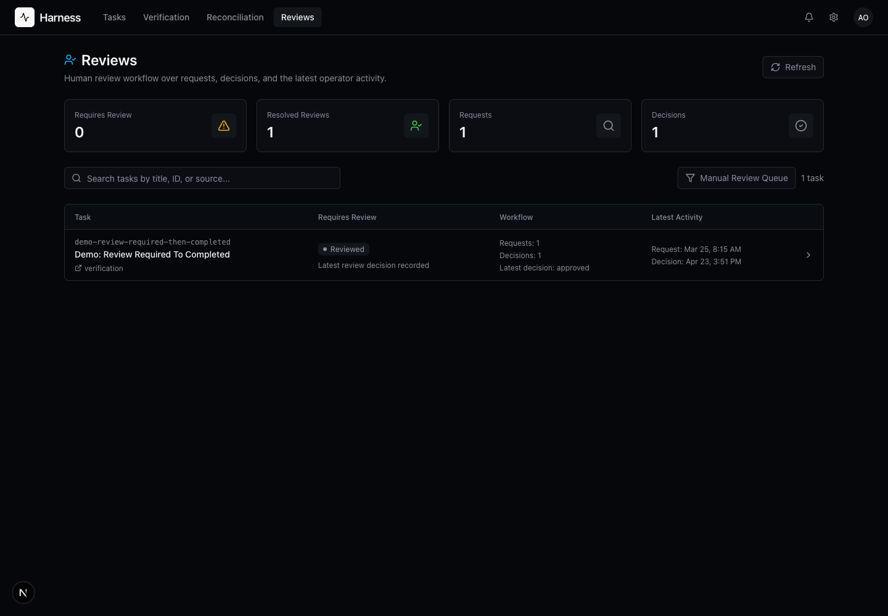
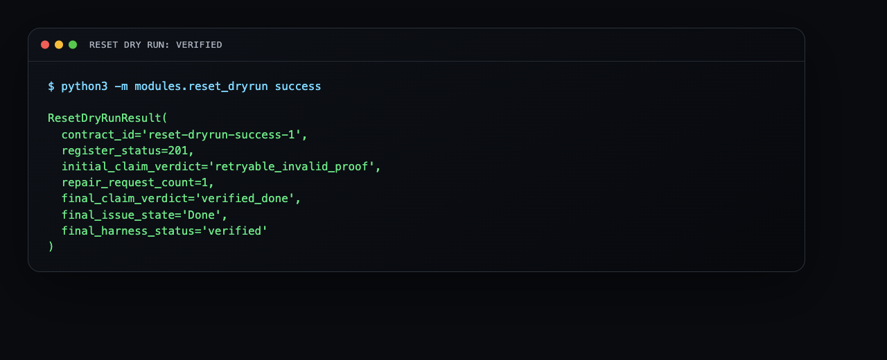
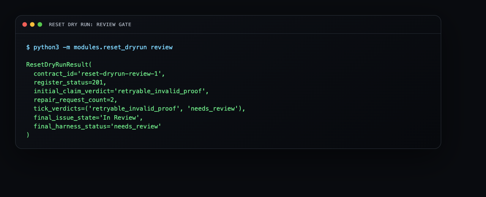

# Use Harness

This guide shows the day-one operator loop: start Harness, inspect the current task truth, and validate that the verifier is enforcing evidence instead of accepting claims on trust.

## Check Backend Health

The health endpoint is the fastest proof that the local backend is up and using the expected storage mode.



Run:

```bash
curl -sS http://127.0.0.1:8000/health
```

For local CLI/runtime operation, use the runtime status command:

```bash
python3 -m modules.local_runtime --json status
```

## Open The Dashboard

The dashboard reads canonical Harness APIs. It should show real backend errors when the API is unavailable, not sample data pretending to be live.



Developer dashboard:

```text
http://127.0.0.1:3000/tasks
```

Local static dashboard:

```text
http://127.0.0.1:8765/dashboard/tasks/
```

## Inspect One Task

Open a task detail panel and check the verification, reconciliation, evidence, and timeline fields before trusting the final lifecycle state.



The important question is not whether an agent said the work was complete. The important question is whether Harness has enough current evidence to accept that claim.

## Watch Review Surfaces

Manual review is explicit state. A task that needs review should show up as review-required instead of collapsing into a generic failure or silently completing.



## Validate The Reset Verifier

Run deterministic reset proofs when you want a quick local confidence check.





Commands:

```bash
python3 -m modules.reset_dryrun success
python3 -m modules.reset_dryrun review
```
